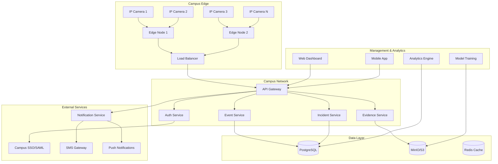

# Design Document

## Overview

The AI-Powered Campus Security system implements a hybrid edge-cloud architecture that processes video streams locally for real-time threat detection while leveraging cloud services for analytics, model training, and centralized management. The system prioritizes privacy-by-design principles, low-latency response, and scalable deployment across campus environments.

## Architecture

### High-Level Architecture



### Edge Computing Layer

**Edge Nodes**: NVIDIA Jetson or GPU-enabled servers deployed across campus
- **AI Inference**: YOLOv8n or MobileNet-based models for real-time object detection
- **Stream Processing**: RTSP stream ingestion and frame analysis
- **Local Storage**: Temporary buffering for incident clips
- **Offline Capability**: Continue operation during network outages

**Edge Processing Pipeline**:
1. RTSP stream ingestion from IP cameras
2. Frame preprocessing and normalization
3. AI model inference for object detection
4. Event filtering and confidence thresholding
5. Incident clip extraction and metadata generation
6. Secure transmission to central services

### Central Services Layer

**API Gateway**: FastAPI-based service mesh with authentication and rate limiting
**Event Service**: Real-time event ingestion and processing
**Incident Management**: Workflow engine for incident lifecycle management
**Evidence Service**: Secure storage and retrieval of video evidence
**Authentication Service**: SSO integration and role-based access control
**Notification Service**: Multi-channel alert distribution

### Data Architecture

**Operational Database**: PostgreSQL for transactional data
- Events, incidents, user management, audit logs
- Optimized for high-write throughput and real-time queries

**Object Storage**: MinIO (S3-compatible) for evidence storage
- Video clips, images, and large binary data
- Lifecycle policies for automated retention management
- Encryption at rest with KMS integration

**Cache Layer**: Redis for session management and real-time data
- User sessions, temporary event data, rate limiting counters

## Components and Interfaces

### Edge Inference Service

```python
class EdgeInferenceService:
    def __init__(self, model_path: str, camera_configs: List[CameraConfig]):
        self.model = YOLO(model_path)
        self.cameras = camera_configs
        self.event_queue = asyncio.Queue()
    
    async def process_camera_stream(self, camera: CameraConfig):
        """Process RTSP stream and generate detection events"""
        
    async def detect_objects(self, frame: np.ndarray) -> List[Detection]:
        """Run AI inference on video frame"""
        
    async def evaluate_threat_level(self, detections: List[Detection]) -> ThreatLevel:
        """Assess threat level based on detection patterns"""
        
    async def generate_incident_clip(self, event: SecurityEvent) -> VideoClip:
        """Extract relevant video segment for evidence"""
```

### Event Processing Service

```python
class EventProcessingService:
    async def ingest_event(self, event: SecurityEvent) -> ProcessingResult:
        """Receive and validate events from edge nodes"""
        
    async def deduplicate_events(self, events: List[SecurityEvent]) -> List[SecurityEvent]:
        """Remove duplicate events from multiple sources"""
        
    async def create_incident(self, event: SecurityEvent) -> Incident:
        """Convert high-confidence events into incidents"""
        
    async def notify_responders(self, incident: Incident) -> NotificationResult:
        """Send alerts to appropriate personnel"""
```

### Privacy and Redaction Service

```python
class PrivacyService:
    async def redact_faces(self, video_clip: VideoClip) -> VideoClip:
        """Apply face blurring to protect privacy"""
        
    async def apply_zone_restrictions(self, clip: VideoClip, zones: List[PrivacyZone]) -> VideoClip:
        """Redact sensitive areas based on privacy zones"""
        
    async def audit_access(self, user: User, evidence_id: str, purpose: str):
        """Log evidence access for compliance"""
        
    async def handle_dsar_request(self, request: DSARRequest) -> DSARResponse:
        """Process data subject access requests"""
```

## Data Models

### Core Entities

```python
@dataclass
class SecurityEvent:
    id: UUID
    camera_id: str
    timestamp: datetime
    event_type: EventType
    confidence_score: float
    bounding_boxes: List[BoundingBox]
    metadata: Dict[str, Any]
    
@dataclass
class Incident:
    id: UUID
    event_ids: List[UUID]
    severity: SeverityLevel
    status: IncidentStatus
    assigned_to: Optional[str]
    created_at: datetime
    resolved_at: Optional[datetime]
    
@dataclass
class Evidence:
    id: UUID
    incident_id: UUID
    file_path: str
    file_type: str
    duration: Optional[float]
    redaction_applied: bool
    access_log: List[AccessRecord]
```

### Database Schema

```sql
-- Events table for high-volume writes
CREATE TABLE events (
    id UUID PRIMARY KEY,
    camera_id VARCHAR(50) NOT NULL,
    timestamp TIMESTAMPTZ NOT NULL,
    event_type VARCHAR(50) NOT NULL,
    confidence_score DECIMAL(3,2),
    metadata JSONB,
    created_at TIMESTAMPTZ DEFAULT NOW()
);

-- Incidents table for workflow management
CREATE TABLE incidents (
    id UUID PRIMARY KEY,
    severity VARCHAR(20) NOT NULL,
    status VARCHAR(20) NOT NULL,
    assigned_to VARCHAR(100),
    created_at TIMESTAMPTZ DEFAULT NOW(),
    resolved_at TIMESTAMPTZ
);

-- Evidence table for secure file tracking
CREATE TABLE evidence (
    id UUID PRIMARY KEY,
    incident_id UUID REFERENCES incidents(id),
    file_path VARCHAR(500) NOT NULL,
    file_type VARCHAR(50),
    redaction_applied BOOLEAN DEFAULT true,
    created_at TIMESTAMPTZ DEFAULT NOW()
);

-- Audit log for compliance
CREATE TABLE audit_log (
    id UUID PRIMARY KEY,
    user_id VARCHAR(100) NOT NULL,
    action VARCHAR(100) NOT NULL,
    resource_type VARCHAR(50),
    resource_id VARCHAR(100),
    timestamp TIMESTAMPTZ DEFAULT NOW(),
    ip_address INET,
    user_agent TEXT
);
```

## Error Handling

### Edge Node Resilience
- **Network Failures**: Local buffering with sync on reconnection
- **Model Failures**: Fallback to simpler detection algorithms
- **Hardware Failures**: Automatic failover to backup edge nodes
- **Storage Failures**: Graceful degradation with alert generation

### Central Service Resilience
- **Database Failures**: Read replicas and connection pooling
- **Storage Failures**: Multi-region replication for critical evidence
- **Service Failures**: Circuit breakers and retry mechanisms
- **Authentication Failures**: Cached credentials with refresh tokens

### Data Integrity
- **Event Deduplication**: Time-window and content-based deduplication
- **Evidence Tampering**: Cryptographic signatures and immutable logs
- **Privacy Violations**: Automated redaction with manual override controls
- **Compliance Failures**: Automated policy enforcement and audit alerts

## Testing Strategy

### Unit Testing
- **Edge Services**: Mock camera streams and model inference
- **API Services**: Isolated service testing with test databases
- **Privacy Functions**: Redaction accuracy and compliance validation
- **Data Models**: Schema validation and constraint testing

### Integration Testing
- **End-to-End Flows**: Camera → Detection → Alert → Response
- **Cross-Service Communication**: API contract testing
- **Database Operations**: Transaction integrity and performance
- **External Integrations**: SSO, SMS, and push notification services

### Performance Testing
- **Throughput Testing**: Concurrent camera stream processing
- **Latency Testing**: Detection-to-alert timing validation
- **Load Testing**: System behavior under peak incident loads
- **Stress Testing**: Resource exhaustion and recovery scenarios

### Security Testing
- **Authentication Testing**: SSO integration and session management
- **Authorization Testing**: Role-based access control validation
- **Data Protection Testing**: Encryption and redaction verification
- **Penetration Testing**: Vulnerability assessment and remediation

### Compliance Testing
- **Privacy Testing**: GDPR/FERPA compliance validation
- **Audit Testing**: Complete audit trail verification
- **Retention Testing**: Automated data lifecycle management
- **Access Testing**: Data subject rights and DSAR processing

## Deployment Architecture

### Edge Deployment
- **Container Orchestration**: Docker with systemd for edge nodes
- **Model Distribution**: Secure model updates via container registry
- **Configuration Management**: Centralized config with local overrides
- **Monitoring**: Prometheus metrics collection and alerting

### Cloud Deployment
- **Kubernetes**: EKS/GKE/AKS for scalable service deployment
- **Service Mesh**: Istio for traffic management and security
- **Database**: Managed PostgreSQL with read replicas
- **Storage**: S3-compatible object storage with lifecycle policies

### Security Considerations
- **Network Security**: VPN/private networking between edge and cloud
- **Certificate Management**: Automated TLS certificate rotation
- **Secrets Management**: HashiCorp Vault or cloud KMS integration
- **Access Control**: Zero-trust networking with service authentication